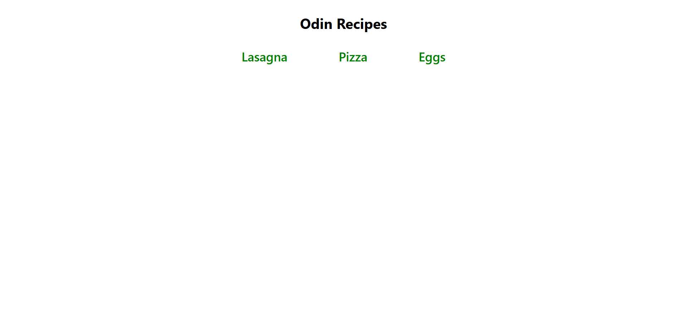

# Odin Recipes

A basic recipe website built with HTML for [The Odin Project](https://www.theodinproject.com/) Foundations course.

## Overview
- **Purpose**: Practice fundamental HTML skills (links, images, text formatting) by creating a multi-page static website.
- **Features**:
  - Index page with recipe links
  - Individual recipe pages (ingredients + instructions)
  - Proper file structure



➡ **Live Demo**: [https://wrzdx.github.io/odin-recipes/](https://wrzdx.github.io/odin-recipes/)

## Technologies Used
- HTML5
- Git/Github (version control)
- Command line basics

## Key Learnings
✅ Created proper HTML boilerplate  
✅ Implemented semantic HTML structure  
✅ Used relative links between pages  
✅ Practiced commit messages and GitHub workflow  
✅ Organized files in a logical directory structure  

## Setup
1. Clone repository:
   ```bash
   git clone https://github.com/wrzdx/odin-recipes.git
2. Open `index.html` in your browser